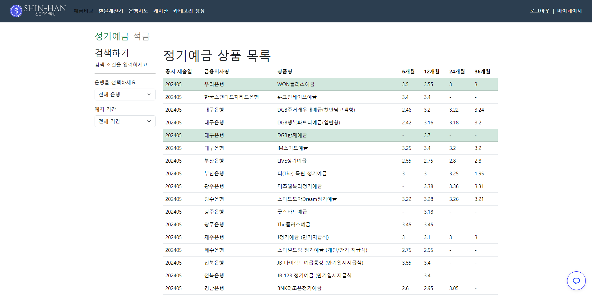
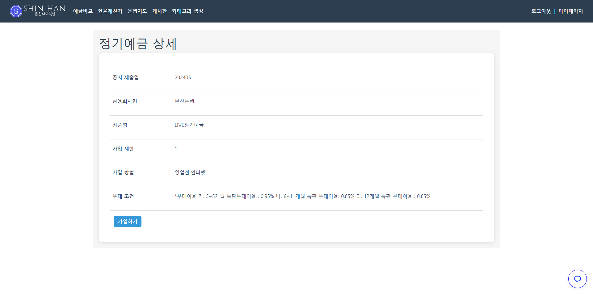
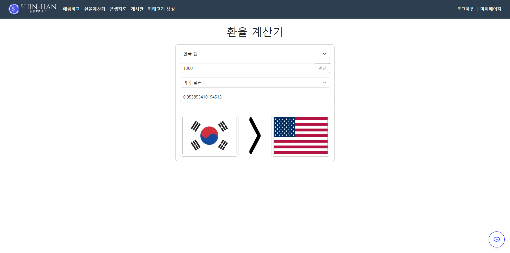
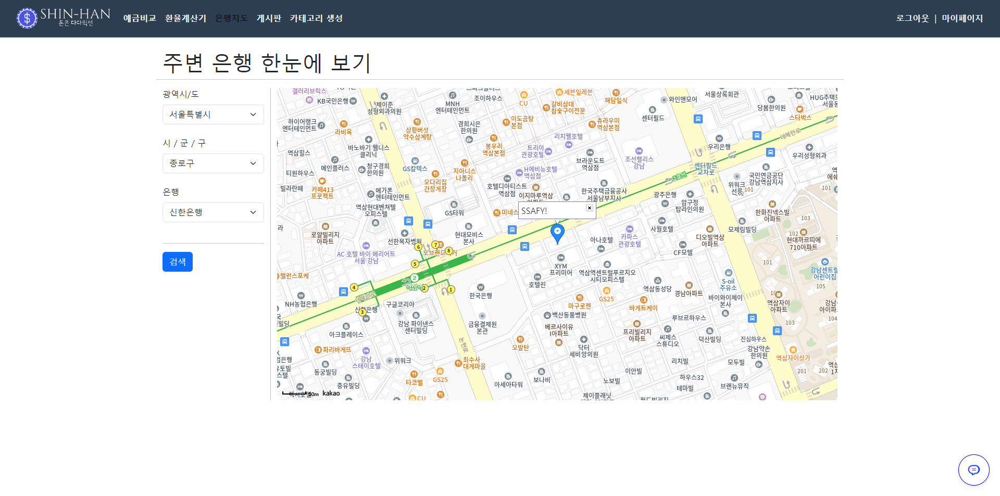
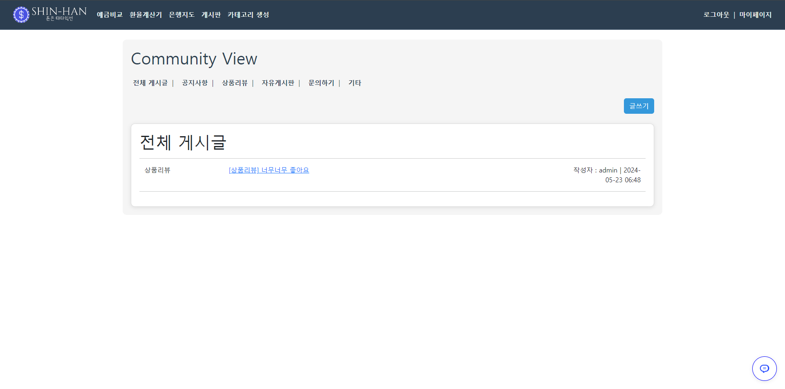
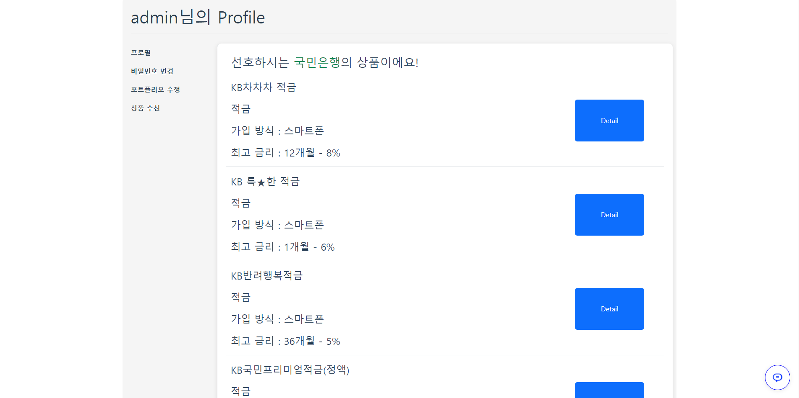
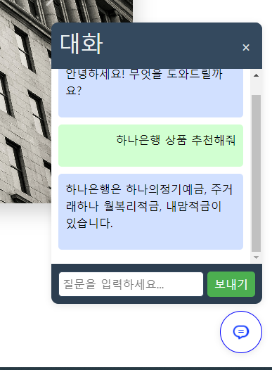

# SHIN-HAN Finance
This project is final project in Samsung Software Academy for Youth 1st semester.

Leader - Hanjin Choi  
member - Minjun Shin

## Tech stack
### Back-End


### Front-End


## Building

You need two terminals

### first terminal
```shell
cd final-pjt/final-pjt-back  # move to back-end folder

python -m venv venv
source venv/Scripts/activate  # make and active venv

pip install -r requirements.txt  # install libraries required

python manage.py migrate
python manage.py runserver  # run django server
```

### second terminal
```shell
cd final-pjt/final-pjt-front  # move to front-end folder

npm install
npm run dev  # run vue3
```

Then, you can access to main page on http://127.0.0.1:5173

### Initial Configuration

You have to make API Keys in `.env` for
- front
  1. Kakao map
- back
  1. Open AI
  2. Financial Supervisory Service (financial product in Korea)
  3. The Export-Import Bank of Korea (exchange rate data in Korea)

## Features
This project can perform

* Providing details about financial products
* Enabling you to participate in a product
* Calculating the amount of money using the exchange rate
* Locating banks near your current location
* Comunity Page
* Providing financial product recommendations based on your information
* Recommendation chatbot

## Configuration
#### Providing details about financial products


#### Enabling you to participate in a product


#### Calculating the amount of money using the exchange rate


#### Locating banks near your current location


#### Comunity Page


#### Providing financial product recommendations based on your information


#### Recommendation chatbot


## Links

API LINKS LIST

- [Kakao Map API](https://apis.map.kakao.com/)
- [Open AI API](https://openai.com/index/openai-api/)
- [Financial Supervisory Service API](https://finlife.fss.or.kr/finlife/main/contents.do?menuNo=700029)
- [The Export-Import Bank of Korea API](https://www.koreaexim.go.kr/ir/HPHKIR020M01?apino=2&viewtype=C&searchselect=&searchword=)
